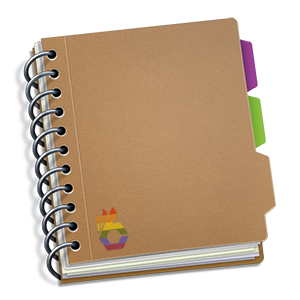

# A handbook of sorts

Here we will cover the parts "unique" to us and therefore weren't covered during onboarding

  

Nais is a complex animal - and if you are new to the team there will be quite a few things that are all but obvious and apparent.

Factoids about the team are posted on [Slack](https://nav-it.slack.com/archives/G013UH65QQZ/p1643208152207700). Take a minute to present your facts, and find out about your colleagues.

The technical [documentation](https://doc.nais.io) is comprehensive but hardly describes how we function as a team.
This handbook is an attempt at bringing some of the silent knowledge to an audible frequency, and at the very least guide you through the bare essentials.
To get you started we recommend that you familiarize yourself with our [manifest](welcome/nais-manifest-eng.md).
The guiding principles that define the how, the what, and the why we do the things that we do.

So now that have you have memorized the manifest and documentation we can get into it all.
