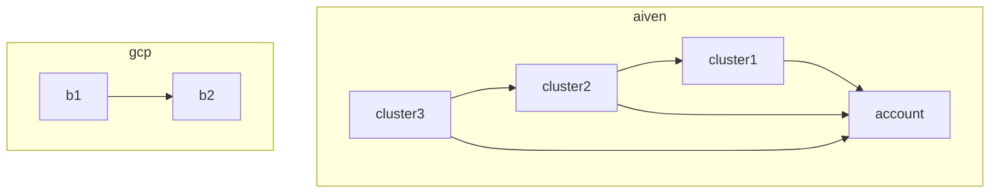

# Aiven

Aiven is a cloud service that provides a fully-managed, high-performance, and secure cloud database.

The primary use case for Aiven is to provide a managed Kafka cluster for NAIS applications. Read more in the [NAIS documentation](https://docs.nais.io/persistence/kafka/).

## Project Overview

