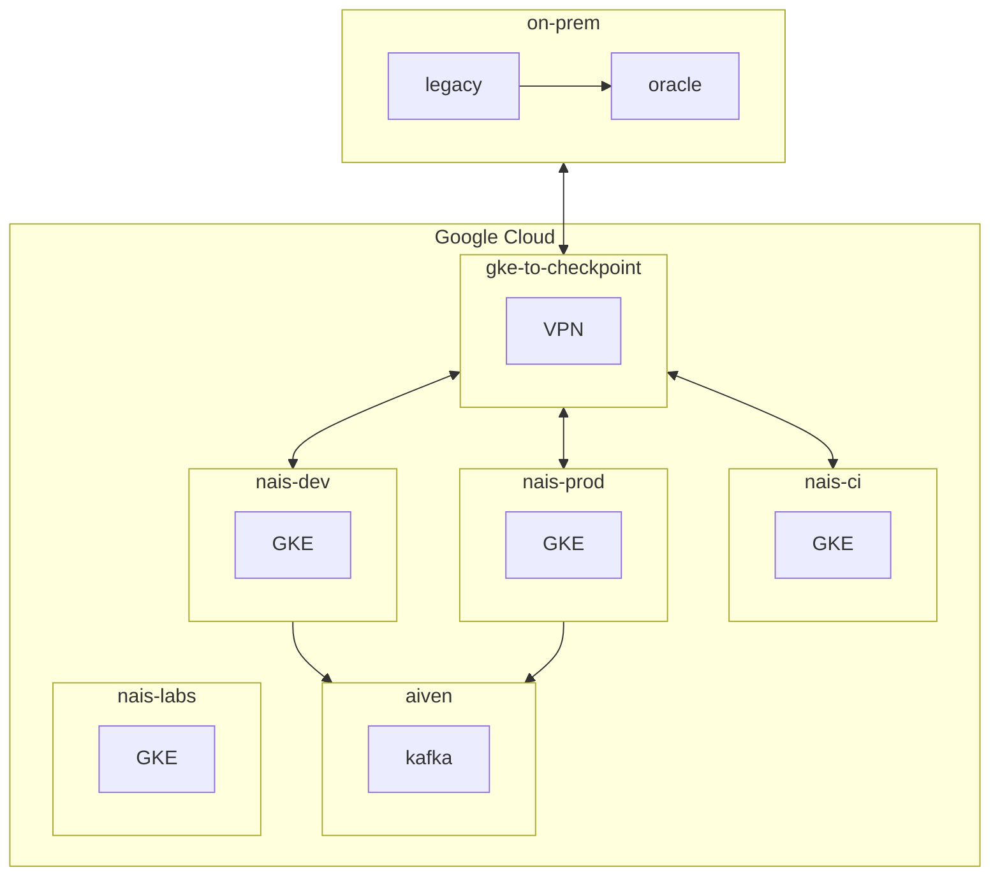

# GCP

GCP is the primary cloud provider for NAV/NAIS.

## NAIS on GCP

NAIS is the first version of NAIS on GCP.

| Repo | Description |
|------|-------------|
| [nais/gcp](https://github.com/nais/gcp) | Terraform infrastructure for network and |
| [nais/nais-platform-apps](https://github.com/nais/nais-platform-apps) | Helm Charts |

### Overview

| Environment | Description |
|-------------|-------------|
| nais-ci | NAIS team CI environment |
| nais-dev | NAIS Application dev and test environment |
| nais-prod | NAIS Application production environment |
| nais-labs | NAIS Application playground environment |

## NAIS v2 (NaaS)

NAIS v2 is the second version of NAIS on GCP. For more information, see the [NaaS documentation](https://naas.nais.io/).