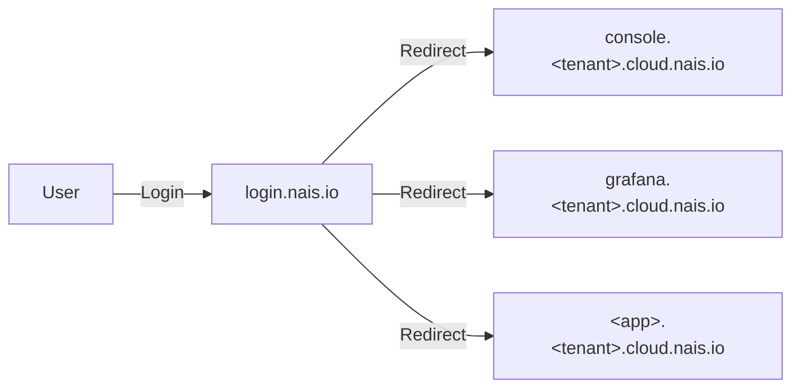
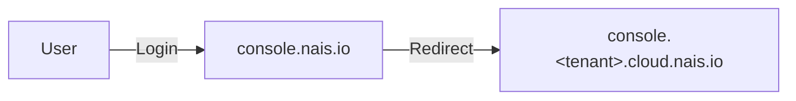

# Identity and Access Management

This page describes the Identity and Access Management (IAM) systems used in Nais.

## Google Workspaces

Users in Nais are currently provisioned and managed in Google Workspaces.
For more information about Google Workspaces, see the [Google Workspaces documentation](https://workspace.google.com/).

## Zitadel

[Zitadel](https://github.com/zitadel/zitadel) is an open-source IAM solution.
We use a self-hosted version in Nais as a central identity provider for internal Nais services and applications, such as Console and CLI.

The instance is available at <https://auth.nais.io>.

A web console is available at <https://auth.nais.io/ui/console>, but is only intended as a view-only interface for the Nais team. Configuration and management should instead be done through Terraform whenever possible.

### Concepts

To learn more about the different resources and concepts in Zitadel, see the [Zitadel documentation](https://zitadel.com/docs/concepts).

#### Instances

We use a single, shared [_instance_](https://zitadel.com/docs/concepts/structure/instance) for the entirety of Nais.
An instance contains multiple [_organizations_](https://zitadel.com/docs/concepts/structure/organizations).

#### Organizations

Each tenant is configured with their own organization.

All users belonging to a tenant are assigned to the same organization.
This is currently handled through the usersync process in Nais API.

Authentication is currently done through OpenID Connect federation through Google, which means that all users must authenticate with their Google accounts.

#### Projects

Within each organization, we have a number of [_projects_](https://zitadel.com/docs/concepts/structure/projects) that are used to group applications and services.

#### Applications

Each project can have multiple [_applications_](https://zitadel.com/docs/concepts/structure/applications) that are used to authenticate users and provide access to resources.

In most cases, there should be a one-to-one relationship between a Project and an Application.

### Runtime

Our instance of Zitadel is deployed to Google Cloud Run and uses a PostgreSQL database in Google Cloud SQL.

- [Cloud Run instance](https://console.cloud.google.com/run/detail/europe-north1/zitadel?project=nais-login)
- [Cloud SQL instance](https://console.cloud.google.com/sql/instances/zitadel?project=nais-login)

The Cloud Run instance runs with a minimum of 1 replica at all times and will scale up and down as needed.
The Cloud SQL instance is configured with high availability and regular backups with point-in-time recovery.

### Structure

The Zitadel instance and its resources are managed through Terraform.

#### [nais-io-terraform-modules](https://github.com/nais/nais-io-terraform-modules/tree/main/modules/nais_login)

Provisions the Zitadel instance itself, including the PostgreSQL database and Cloud Run instance as well as necessary networking services.

All instance-level settings are set and configured here.

The module also provisions the nais.io organization and everything within.
Shared projects and applications that should be available to multiple tenants should be defined in the nais.io organization.

The repository also contains a GitHub Actions workflow at
<https://github.com/nais/nais-io-terraform-modules/blob/main/.github/workflows/zitadel.yaml>.
Runs on a daily schedule and can be manually triggered ad-hoc.
The workflow:

- fetches the latest release of Zitadel
- mirrors the image to Google Artifact Registry
- creates a pull request to point the Cloud Run manifest to the new version

#### [nais-terraform-modules](https://github.com/nais/nais-terraform-modules/blob/main/modules/management/zitadel.tf)

Provisions a Zitadel organization for each tenant.

Tenant-specific Nais services such as Console / API are provisioned here in their own projects and applications.

#### [login.nais.io](https://github.com/nais/login.nais.io)

This is a multi-tenant application that serves as a portal to show the authenticated user correct links to tenant-specific Nais services based on the organization they belong to.

A variant at <https://console.nais.io> automatically redirects the authenticated user to the correct Console.

### Monitoring

See the [Grafana dashboard at monitoring.nais.io](https://monitoring.nais.io/d/bel6280x2srggc/zitadel)

### Maintenance

The Zitadel binary is generally built to manage upgrades in a straightforward manner with zero downtime.
For more information, refer to Zitadels documentation:

- <https://zitadel.com/docs/self-hosting/manage/updating_scaling>
- <https://zitadel.com/docs/concepts/architecture/solution#zero-downtime-updates>

The upgrade process currently looks like this:

- The automated GitHub Actions workflow in [nais-io-terraform-modules](#nais-io-terraform-modules) will notify us when a new version is available through a pull request
- Review the [Zitadel release notes on GitHub](https://github.com/zitadel/zitadel/releases)
- Review the [Zitadel Changelog](https://zitadel.com/changelog)
- Review [technical advisories from Zitadel](https://zitadel.com/docs/support/technical_advisory)
- Plan and apply the pull request

At some point we should consider a mirrored staging environment to test the upgrade process before applying it to production.

### Troubleshooting

- Check relevant logs and metrics, see the links in the [Monitoring section](#monitoring)
- [Troubleshoot Zitadel](https://zitadel.com/docs/support/troubleshooting)
- [Troubleshoot Zitadel (self-hosted)](https://zitadel.com/docs/self-hosting/deploy/troubleshooting)
- [Troubleshoot Cloud Run](https://cloud.google.com/run/docs/troubleshooting)
- [Troubleshoot Cloud SQL](https://cloud.google.com/sql/docs/postgres/troubleshooting)
