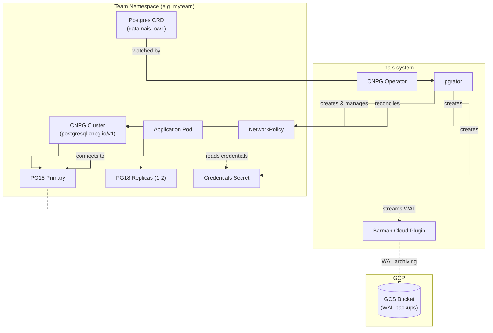
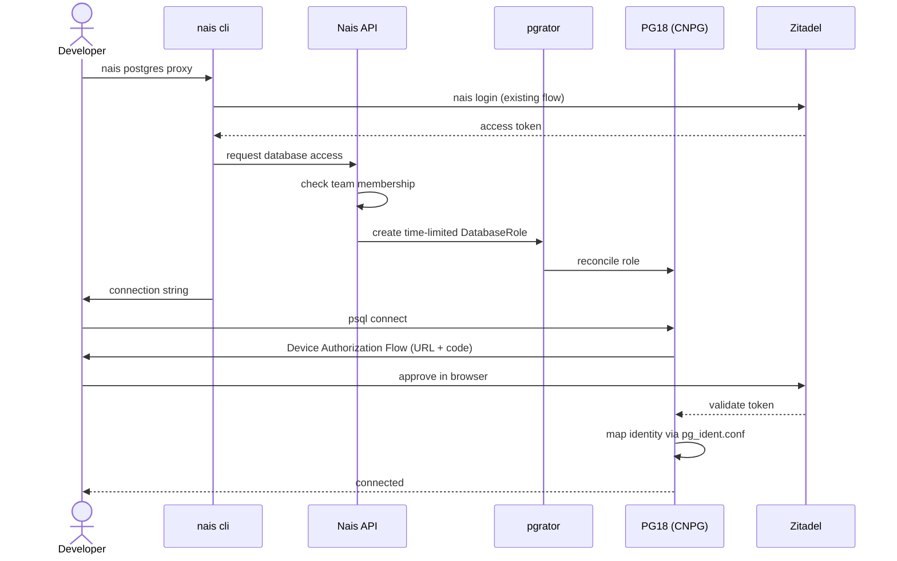

Nais Databases
==============

!!! note "Replaces Zalando postgres-operator and CloudSQL"
    This setup replaces both CloudSQL and the Zalando postgres-operator. For the previous Zalando setup, see [postgres.md](postgres.md).

Nais provides managed PostgreSQL databases through [pgrator](https://github.com/nais/pgrator), a Kubernetes operator that abstracts database provisioning for teams. Under the hood, pgrator uses [CloudNative PG](https://cloudnative-pg.io/) (CNPG) to run PostgreSQL clusters on Kubernetes.

Only PostgreSQL 18+ is supported. PG18 has native OAuth2 authentication, which is required for personal database access.

How teams use it
----------------

Teams create a `Postgres` resource (`data.nais.io/v1`) in their namespace. Pgrator picks it up and provisions everything needed: the database cluster, backups, network policies, monitoring, and IAM resources.

The `Postgres` CRD is the only interface teams interact with. See the [pgrator README](https://github.com/nais/pgrator/blob/main/README.md) for the CRD specification.

Database clusters run in the team's own namespace, alongside the application pods. Secrets, network policies, and RBAC are all scoped to the same namespace.

How pgrator works
-----------------

Pgrator reconciles `Postgres` CRDs into CNPG `Cluster` resources (`postgresql.cnpg.io/v1`). For each `Postgres` resource, pgrator creates and manages:

- A CNPG `Cluster` in the team namespace
- Backup configuration via Barman Cloud
- Network policies for pod-to-database access
- PrometheusRules for alerting (CPU/memory thresholds)
- IAM resources (GCP WorkloadIdentity, GCS bucket policies for WAL backups, Cloud Logging)

Pgrator also manages Valkey and OpenSearch databases (via Aiven), but those are separate from the CNPG setup.

How CNPG runs PostgreSQL
-------------------------

CNPG manages pod lifecycles directly — no StatefulSets or external HA tools. Each `Cluster` maps to a set of PostgreSQL pods where one is primary and the rest are replicas. Failover, replication, and fencing are handled by a built-in instance manager running inside each pod.

Properties relevant to nais:

- Standard PostgreSQL container images (no custom builds needed)
- Runs as non-root by default
- Backup and WAL archiving via the [Barman Cloud](https://github.com/cloudnative-pg/plugin-barman-cloud) plugin
- Extensions loaded dynamically via OCI images (ImageVolume) on PG18

Upstream docs: [cloudnative-pg.io/documentation](https://cloudnative-pg.io/documentation/current/)

Barman Cloud Plugin
-------------------

[Barman Cloud](https://github.com/cloudnative-pg/plugin-barman-cloud) is the backup component. It runs as a separate pod in the operator namespace and communicates with the CNPG operator over gRPC. PostgreSQL instances stream WAL segments to Barman Cloud, which writes them to object storage (GCS in our case). Barman Cloud also handles scheduled base backups and point-in-time recovery (PITR) — restoring a cluster to any moment between base backups by replaying the archived WAL stream. Each CNPG `Cluster` references a backup configuration that tells Barman Cloud which bucket to use, how often to take base backups, and how long to retain them.

CNPG operator deployment
-------------------------

The CNPG operator and Barman Cloud plugin are deployed as a helm-charts feature:

- Feature definition: [`features/cloudnative-pg/`](https://github.com/nais/helm-charts/tree/main/features/cloudnative-pg)
- Depends on: cert-manager
- Deployed to: tenant and management clusters
- Inherited labels: `apiserver-access`, `team`
- Inherited annotations: `resource-remover.nais.io/skip`
- Monitoring: PodMonitor enabled

Network policies allow the operator egress to tenant namespaces on ports 5432 (PostgreSQL) and 8000 (HTTP), and bidirectional traffic between the operator and Barman Cloud on port 9090.

Personal database access
-------------------------

Personal access uses PG18's native OAuth2 authentication (`SASL OAUTHBEARER`, RFC 7628) with [Zitadel](https://github.com/nais/handbook/blob/main/docs/technical/iam/README.md) as the identity provider.

The flow:

1. Developer runs `nais postgres proxy` (or equivalent)
2. nais cli authenticates with Zitadel (existing `nais login` flow)
3. Nais API checks team membership and creates a time-limited `DatabaseRole`
4. pgrator reconciles the role into the CNPG cluster
5. Developer connects with `psql` — PG18 runs Device Authorization Flow in the terminal
6. PostgreSQL validates the token via a validator module and maps the identity to a PG role via `pg_ident.conf`

This depends on the CNPG `DatabaseRole` CRD, planned for [v1.30](https://github.com/cloudnative-pg/cloudnative-pg/milestone/35). See the [detailed design](https://github.com/nais/system/blob/main/persistence/lansering-av-postgres-operator/personlig-databasetilgang-cnpg.md).

What is not yet in place
------------------------

**Pgrator CNPG reconciler** — The pgrator reconciler that creates CNPG `Cluster` resources from `Postgres` CRDs is not yet implemented.

**Personal database access** — Waiting on CNPG `DatabaseRole` CRD (v1.30) and PG18 OAuth2 validator integration with Zitadel.

**Backup strategy** — Barman Cloud is deployed but the per-cluster backup configuration (bucket layout, retention, restore procedures) needs to be defined and wired into pgrator.

**Migration tooling** — Tooling to migrate existing databases to CNPG clusters. The [CloudSQL migrator design](https://github.com/nais/system/blob/main/persistence/cloudsql-migrator/cloudsql-migrator.md) may inform the approach.

**Console visibility** — Showing databases in Console. See [design](https://github.com/nais/system/blob/main/persistence/lansering-av-postgres-operator/triumph-of-the-operator.md).

**DBA tooling** — Troubleshooting procedures and DBA access patterns.

Reference material
------------------

- [pgrator source](https://github.com/nais/pgrator)
- [CNPG upstream docs](https://cloudnative-pg.io/documentation/current/)
- [Personal database access design](https://github.com/nais/system/blob/main/persistence/lansering-av-postgres-operator/personlig-databasetilgang-cnpg.md)
- [Current blockers (March 2026)](https://github.com/nais/system/blob/main/persistence/lansering-av-postgres-operator/fot-i-bakken-20260306.md)
- [Rollout phases](https://github.com/nais/system/blob/main/persistence/lansering-av-postgres-operator/the-fellowship-of-the-database.md)
- [Tuned cluster example](https://github.com/nais/helm-charts/blob/main/cnpg-cluster-tuned.yaml)
- [CNPG evaluation](https://github.com/nais/system/blob/main/persistence/evaluere-cnpg-operator/oppsummering.md)
- [Operator decision history](https://github.com/nais/system/blob/main/persistence/lansering-av-postgres-operator/ny-vurdering-av-cnpg.md)
