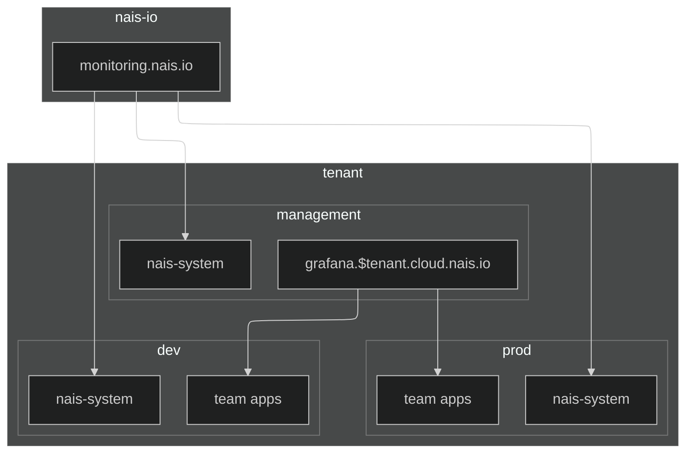
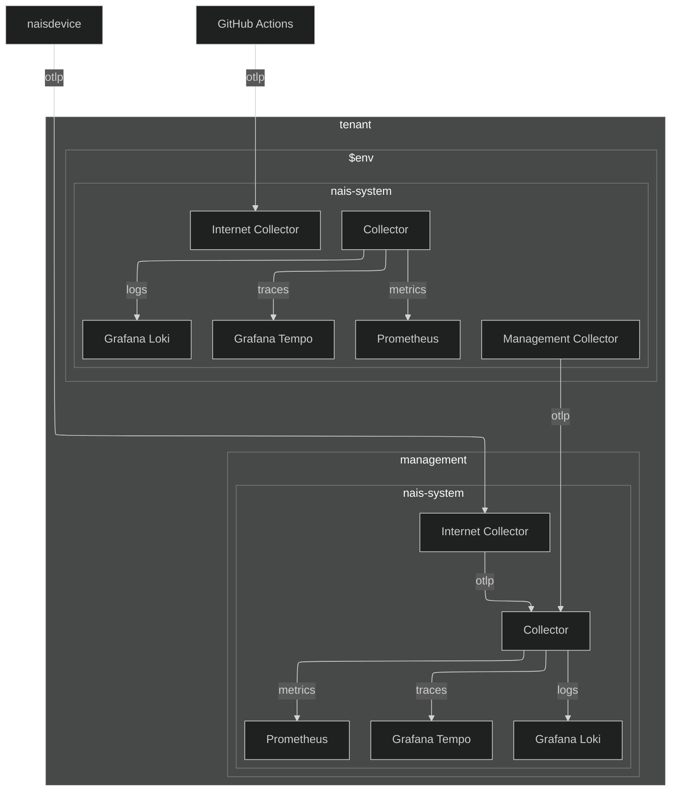
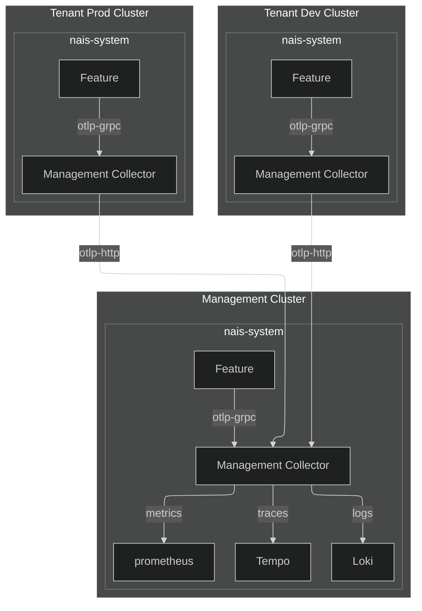

# Observability Stack

Sit back and relax, we got you covered. The observability stack in nais is designed to provide you with all the tools you need to monitor and troubleshoot your applications.

## Overview

On a high level there are two parallel observability stacks in nais, one for nais-system namespaces (we call it the management stack) and one for tenant applications. Both stacks are based on the same components – Prometheus for metrics, Loki for logs, and Tempo for traces and Grafana for visualization.



The observability stack in nais consists of the following components:

<div class="grid cards" markdown>

- :simple-prometheus: [__Prometheus Operator__](https://prometheus-operator.dev/) for managing Prometheus instances, providing easy monitoring definitions for Kubernetes services and deployment and management of Prometheus instances.
- :simple-prometheus: [__Prometheus__](https://prometheus.io/) for metrics, offering powerful querying and alerting capabilities to monitor the performance and health of applications.
- :simple-prometheus: [__Alertmanager__](https://prometheus.io/docs/alerting/alertmanager/) for alerting, handling alerts sent by client applications such as the Prometheus server and managing silencing, inhibition, and alert grouping.
- :simple-grafana: [__Grafana__](https://grafana.com/) for visualization, enabling the creation of dashboards and graphs to visualize metrics, logs, and traces from various data sources.
- :simple-grafana: [__Grafana Loki__](https://grafana.com/oss/loki/) for logs, providing a highly efficient and cost-effective log aggregation system that integrates seamlessly with Grafana.
- :simple-grafana: [__Grafana Tempo__](https://grafana.com/oss/tempo/) for traces, offering a scalable and high-performance distributed tracing backend that integrates with Grafana for trace visualization.
- :simple-opentelemetry: [__OpenTelemetry Collector__](https://opentelemetry.io/docs/collector/) for collecting, processing, and exporting telemetry data, supporting multiple formats and providing a vendor-agnostic solution for telemetry data management.
- :simple-fluentd: [__Logging Operator__](https://kube-logging.dev) for collecting logs from stdout/stderr, simplifying the deployment and management of Fluentd log collectors in Kubernetes environments.

</div>

## OpenTelemetry Collector

The OpenTelemetry Collector is a vendor-agnostic, open-source telemetry collector that can be used to collect, process, and export telemetry data. It is a powerful tool that can be used to collect logs, metrics, and traces from a variety of sources and export them to a variety of destinations.

OpenTelemetry Collector implements the [OpenTelemetry protocol (OTLP)](https://opentelemetry.io/docs/specs/otlp/) which is a standard for transmitting telemetry data.

We have two parallel OpenTelemetry Collectors running in nais, one for the management stack and one for tenant applications. The management collector is used to collect telemetry data from nais-system namespaces and the tenant collector is used to collect telemetry data from tenant applications.



=== "Full otlp"

    Full otlp is used when all telemetry data is sent to the OpenTelemetry Collector including logs, metrics, and traces.

    ```mermaid
    graph LR
      Feature[Feature]
      OtelCollector[Collector]
      Loki
      prometheus
      Tempo

      Feature -- otlp --> OtelCollector

      OtelCollector -- traces --> Tempo
      OtelCollector -- logs --> Loki
      OtelCollector -- metrics --> prometheus

      Tempo -- query --> Grafana
      Loki -- query --> Grafana
      prometheus -- query --> Grafana
    ```

=== "Traces only"

    Traces only is used when only traces are sent to the OpenTelemetry Collector, logs are sent using stdout/stderr and metrics are scraped by Prometheus.

    ```mermaid
    graph LR
      Feature[Feature]
      OtelCollector[Collector]
      LoggingOperator
      Loki
      prometheus
      Tempo

      Feature -- traces --> OtelCollector
      Feature -- stdout/stderr --> LoggingOperator
      LoggingOperator -- forward --> Loki
      Feature -- scrape --> prometheus
      OtelCollector -- traces --> Tempo

      Tempo -- query --> Grafana
      Loki -- query --> Grafana
      prometheus -- query --> Grafana
    ```

### Endpoints

The OpenTelemetry Collector exposes the following endpoints:

| Endpoint                                            | Description                                                   |
| --------------------------------------------------- | ------------------------------------------------------------- |
| `http://opentelemetry-management-collector:4317`    | Internal endpoint for features in nais-system namespace.      |
| `https://collector-internet.<tenant>.cloud.nais.io` | Internet exposed endpoint for things running outside of nais. |

Fasit features can use environment values in `Feature.yaml` to get the correct OpenTelemetry config without hardcoding the endpoint.

??? example "Feature.yaml"
    ```yaml
    values:
      observability.otelp.endpoint:
        computed:
          template: "{{ .Env.otel_otlp_endpoint }}"
      observability.otelp.protocol:
        computed:
          template: "{{ .Env.otel_otlp_protocol }}"
      observability.otelp.insecure:
        computed:
          template: "{{ .Env.otel_otlp_insecure }}"
    ```

### Tenant Clusters

All nais clusters have a dedicated OpenTelemetry Collector instance running in the `nais-system`. Tenant clusters forwards to management cluster using the `otlp-http` endpoint so that all telemetry data from nais-system is collected in a single place.

