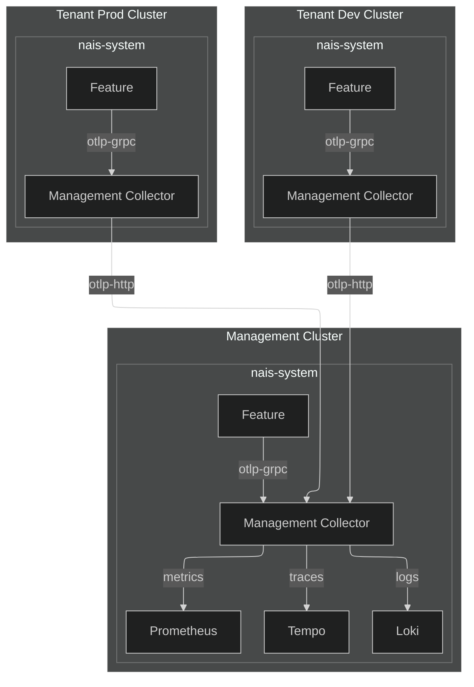

# Observability Stack

This document describes the technical observability stack for nais-system Features.

## Overview

The observability stack in nais consists of the following components:

- [Alertmanager](https://prometheus.io/docs/alerting/alertmanager/)
- [Grafana](https://grafana.com/)
- [Grafana Agent](https://grafana.com/docs/grafana-cloud/agent/)
- [Logging Operator](https://kube-logging.dev)
- [Loki](https://grafana.com/oss/loki/)
- [OpenTelemery Operator](https://opentelemetry.io/docs/operator/)
- [OpenTelemetry Collector](https://opentelemetry.io/docs/collector/)
- [Prometheus Operator](https://prometheus-operator.dev/)
- [Prometheus](https://prometheus.io/)
- [Tempo](https://grafana.com/oss/tempo/)

## OpenTelemetry Collector

The OpenTelemetry Collector is a vendor-agnostic, open-source telemetry collector that can be used to collect, process, and export telemetry data. It is a powerful tool that can be used to collect logs, metrics, and traces from a variety of sources and export them to a variety of destinations.

OpenTelemetry Collector implements the [OpenTelemetry protocol (OTLP)](https://opentelemetry.io/docs/specs/otlp/) which is a standard for transmitting telemetry data.

=== "otlp"

    ```mermaid
    graph LR
      Feature[Feature]
      OtelCollector[Collector]
      Loki
      Prometheus
      Tempo

      Feature -- otlp --> OtelCollector

      OtelCollector -- traces --> Tempo
      OtelCollector -- logs --> Loki
      OtelCollector -- metrics --> Prometheus

      Tempo -- query --> Grafana
      Loki -- query --> Grafana
      Prometheus -- query --> Grafana
    ```

=== "traces only"

    ```mermaid
    graph LR
      Feature[Feature]
      OtelCollector[Collector]
      LoggingOperator
      Loki
      Prometheus
      Tempo

      Feature -- traces --> OtelCollector
      Feature -- stdout/stderr --> LoggingOperator
      LoggingOperator -- forward --> Loki
      Feature -- scrape --> Prometheus
      OtelCollector -- traces --> Tempo

      Tempo -- query --> Grafana
      Loki -- query --> Grafana
      Prometheus -- query --> Grafana
    ```

### Endpoints

The OpenTelemetry Collector exposes the following endpoints:

- `http://opentelemetry-management-collector:4317` - OpenTelemetry Protocol (OTLP) endpoint for receiving traces, metrics, and logs from Features.
- `https://collector-internet.<tenant>.cloud.nais.io/otlp-http` - Internet exposed OTLP endpoint for receiving traces, metrics, and logs from Features running outside of nais.

Featurelikasjoner i Fasit kan du bruke følgende `Feature.yaml` config for å få riktig OpenTelemetry konfigurasjons:

```yaml
values:
  observability.otelp.endpoint:
    computed:
      template: "{{ .Env.otel_otlp_endpoint }}"
  observability.otelp.protocol:
    computed:
      template: "{{ .Env.otel_otlp_protocol }}"
  observability.otelp.insecure:
    computed:
      template: "{{ .Env.otel_otlp_insecure }}"
```

### Tenant Clusters

All nais clusters have a dedicated OpenTelemetry Collector instance running in the `nais-system`. Tenant clusters forwards to management cluster using the `otlp-http` endpoint so that all telemetry data from nais-system is collected in a single place.

