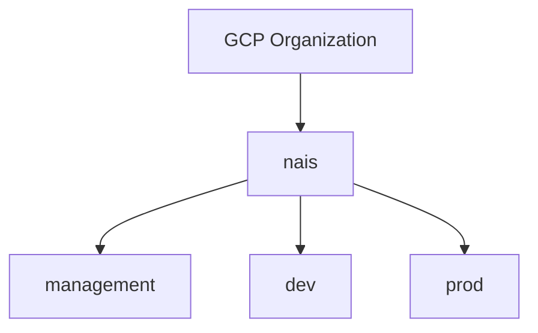

# Step 2 - Tenant preparations

When setting up Nais in your Google organization, they will need a dedicated folder for all resources related to Nais. Everything Nais related will be contained within this folder, and no further permissions are required in the organization.

Example:



## Required settings

On the user that will run the following commands, the following IAM roles are
required on an organization level.

- `Owner`
- `Organization Administrator`
- `Folder Creator`
- `Organization Policy Administrator`

### Disable Domain restricted sharing
- If `Domain restricted sharing` is enabled, allow users from nais.io (nais-io) by adding the domain to `iam.allowedPolicyMemberDomains` under `IAM/Organization Policies`
TODO: steps to do this. This must happen before the next step because we are refering to nais.io.

### Create the NAIS folder

Everything related to NAIS is contained within this folder.

```bash
export NAAS_ORG_NAME=my-org # (1)
export NAAS_ORG_ID=$(gcloud organizations list --filter $NAAS_ORG_NAME --format "value(name)")

gcloud organizations add-iam-policy-binding "$NAAS_ORG_ID" --member="domain:nais.io" --role="roles/compute.osLoginExternalUser"
gcloud resource-manager folders create --display-name=nais --organization=$NAAS_ORG_ID
export NAAS_GOOGLE_FOLDERID=$(gcloud resource-manager folders list --organization="$NAAS_ORG_ID" --filter "displayName=nais AND parent=organizations/${NAAS_ORG_ID}" --format "value(name)")
```

1. :man_raising_hand: Change this to the name of your Google Organization

#### Grant access to the NAIS team and the terraform user

To allow the NAIS team the required permissions to operate nais, IAM policies
must be added to the NAIS folder.

!!! bug

    Find correct roles for the following users:

    - nais-viewers
    - nais-admins

??? "Copy and run this command"

    ```bash
    cat <<EOF > naas-google-org-policy.json
    {
      "bindings": [
        {
          "members": [
            "serviceAccount:nais-tf-__TENANTNAME__@nais-io.iam.gserviceaccount.com"
          ],
          "role": "roles/artifactregistry.admin"
        },
        {
          "members": [
            "serviceAccount:nais-tf-__TENANTNAME__@nais-io.iam.gserviceaccount.com"
          ],
          "role": "roles/compute.admin"
        },
        {
          "members": [
            "serviceAccount:nais-tf-__TENANTNAME__@nais-io.iam.gserviceaccount.com"
          ],
          "role": "roles/container.admin"
        },
        {
          "members": [
            "serviceAccount:nais-tf-__TENANTNAME__@nais-io.iam.gserviceaccount.com"
          ],
          "role": "roles/dns.admin"
        },
        {
          "members": [
            "serviceAccount:nais-tf-__TENANTNAME__@nais-io.iam.gserviceaccount.com"
          ],
          "role": "roles/logging.admin"
        },
        {
          "members": [
            "serviceAccount:nais-tf-__TENANTNAME__@nais-io.iam.gserviceaccount.com"
          ],
          "role": "roles/resourcemanager.folderCreator"
        },
        {
          "members": [
            "serviceAccount:nais-tf-__TENANTNAME__@nais-io.iam.gserviceaccount.com"
          ],
          "role": "roles/resourcemanager.folderIamAdmin"
        },
        {
          "members": [
            "serviceAccount:nais-tf-__TENANTNAME__@nais-io.iam.gserviceaccount.com"
          ],
          "role": "roles/resourcemanager.projectCreator"
        },
        {
          "members": [
            "serviceAccount:nais-tf-__TENANTNAME__@nais-io.iam.gserviceaccount.com"
          ],
          "role": "roles/serviceusage.serviceUsageAdmin"
        }
      ]
    }
    EOF
    read -p "Enter NaaS Tenant Name [$NAAS_TENANTNAME]: " TENANTNAME && \
    export NAAS_TENANTNAME="${TENANTNAME:-$NAAS_TENANTNAME}" && \
    sed -ie "s/__TENANTNAME__/$NAAS_TENANTNAME/g" naas-google-org-policy.json && \
    echo "gcloud resource-manager folders set-iam-policy $NAAS_GOOGLE_FOLDERID naas-google-org-policy.json"
    ```

## Teams and users (admin google com


### Create Kubernetes security group (in tenant admin.google.com)

This group is used to manage access to the kubernetes clusters, and this is where Nais automatically adds teams that should have access to the clusters.

In [Google Admin](https://admin.google.com) create a group named `gke-security-groups`.
Make sure the group has the **View Members** permission selected for **Group Members**.


### Create nais admin user (in tenant admin.google.com)

Nais needs a dedicated user account in the Google directory. This user must be manually created [in the Google Admin console](https://admin.google.com/ac/users). The user must be granted the `Groups Admin` role to be able to create and maintain groups for the teams:

1. Go to [https://admin.google.com/ac/users](https://admin.google.com/ac/users)
1. Click on `Add new user`
1. Enter `nais` as first name, and `admin` as last name
1. Enter `nais-admin` as the primary email
1. Click `Add new user` to add the user account (you can safely ignore the generated password)
1. Click on the created user (might require a hard refresh of the user list) and then on `Assign roles` under the `Admin roles and privileges` section
1. Assign the `Groups Admin` role and click `Save`


### Create Console admins group (in tenant admin.google.com)

Nais (API) automatically syncs users from the Google Workspace to its own database. Tenants can control which users that should be assigned the admin role in Nais by creating a group called `console-admins@<tenant-domain>`, and then add the necessary users to this group. When Console/Nais API runs the user sync it will look for this group, and make sure that the users in the group are granted the admin role.
Whenever a user is removed from the group, Nais will revoke the admin role from the user on the next sync.

1. Go to [https://admin.google.com/ac/groups](https://admin.google.com/ac/groups)
1. Click on `Create group`
1. Enter `console-admins` as the group name
1. Enter `console-admins` as the email address
1. Enter `This group is used to control who has admin permissions in the Nais Console` as the description
1. Click `Next`
1. Select 'Only invited users' in the 'Who can join the group' section. Leave the rest as default.
1. Click `Create Group`

Users with the admin role in Console have access to some additional settings:

- Configure / enable / disable reconcilers
- Grant / revoke roles
- Manipulate reconciler states for teams


## Highly recommended settings

### Log location

Every project created in GCP will have a default log location for all logs. The default is Global.
In order to keep your logs in europe, we _strongly_ recommend setting the default log location to europe using the following command

```bash
gcloud alpha logging settings update --organization=$NAAS_ORG_ID --storage-location=europe-north1
```

### Organization policy for location

Although all resources created by NAIS is located within the EU, teams are still able to create resources anywhere unless an organizational constraint is in place.

<details>
<summary>Click to see file content</summary>
``` yaml
constraint: constraints/gcp.resourceLocations
etag: BwVUSr8Q7Ng=
listPolicy:
  allowedValues:
  - in:eu-locations
```
</details>

```bash
gcloud beta resource-manager org-policies set-policy --organization=$NAAS_ORG_ID <file name>.yaml
```
