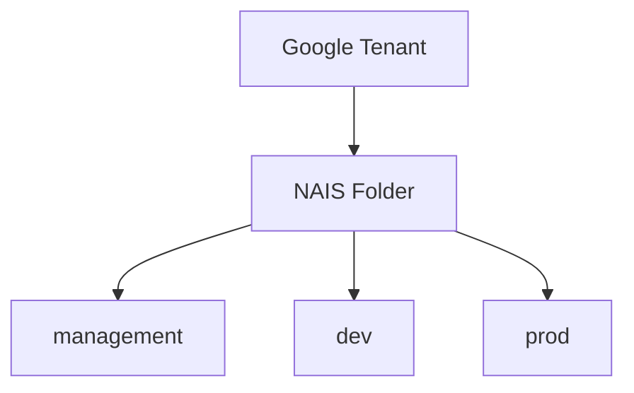

# Setting up a tenant organization

This guide is used when setting up a new tenant. This is typically done by the NAIS team, together with the tenants administrators.



## Prereq

- Google Cloud Tenant admin
- GitHub Organization

## Required settings

### Required permissions

On the user that will run the following commands, the following IAM roles are
required on an organization level.

- `Owner`
- `Organization Administrator`
- `Folder Creator`
- `Organization Policy Administrator`

### Create the NAIS folder

Everything related to NAIS is contained within this folder.

```bash
export NAAS_ORG_NAME=my-org # (1)
export NAAS_ORG_ID=$(gcloud organizations list --filter $NAAS_ORG_NAME | tail -n1 | awk '{print $2}')

gcloud resource-manager folders create --display-name=nais --organization=$NAAS_ORG_ID
export NAAS_GOOGLE_FOLDERID=$(gcloud resource-manager folders list --organization=$NAAS_ORG_ID | grep nais | awk '{print $3}')
```

1. :man_raising_hand: Change this to the name of your Google Organization

#### Grant access to the NAIS team and the terraform user

To allow the NAIS team the required permissions to operate nais, IAM policies
must be added to the NAIS folder.

!!! bug

    Find correct roles for the following users:

    - nais-viewers
    - nais-admins

??? "Copy and run this command"

    ```bash
    cat <<EOF > naas-google-org-policy.json
    {
      "bindings": [
        {
          "members": [
            "serviceAccount:nais-tf-__TENANTNAME__@nais-io.iam.gserviceaccount.com"
          ],
          "role": "roles/artifactregistry.admin"
        },
        {
          "members": [
            "serviceAccount:nais-tf-__TENANTNAME__@nais-io.iam.gserviceaccount.com"
          ],
          "role": "roles/compute.admin"
        },
        {
          "members": [
            "serviceAccount:nais-tf-__TENANTNAME__@nais-io.iam.gserviceaccount.com"
          ],
          "role": "roles/container.admin"
        },
        {
          "members": [
            "serviceAccount:nais-tf-__TENANTNAME__@nais-io.iam.gserviceaccount.com"
          ],
          "role": "roles/dns.admin"
        },
        {
          "members": [
            "serviceAccount:nais-tf-__TENANTNAME__@nais-io.iam.gserviceaccount.com"
          ],
          "role": "roles/logging.admin"
        },
        {
          "members": [
            "serviceAccount:nais-tf-__TENANTNAME__@nais-io.iam.gserviceaccount.com"
          ],
          "role": "roles/resourcemanager.folderCreator"
        },
        {
          "members": [
            "serviceAccount:nais-tf-__TENANTNAME__@nais-io.iam.gserviceaccount.com"
          ],
          "role": "roles/resourcemanager.folderIamAdmin"
        },
        {
          "members": [
            "serviceAccount:nais-tf-__TENANTNAME__@nais-io.iam.gserviceaccount.com"
          ],
          "role": "roles/resourcemanager.projectCreator"
        },
        {
          "members": [
            "serviceAccount:nais-tf-__TENANTNAME__@nais-io.iam.gserviceaccount.com"
          ],
          "role": "roles/serviceusage.serviceUsageAdmin"
        }
      ]
    }
    EOF
    read -p "Enter NaaS Tenant Name [$NAAS_TENANTNAME]: " TENANTNAME && \
    export NAAS_TENANTNAME="${TENANTNAME:-$NAAS_TENANTNAME}" && \
    sed -ie "s/__TENANTNAME__/$NAAS_TENANTNAME/g" naas-google-org-policy.json && \
    echo "gcloud resource-manager folders set-iam-policy $NAAS_GOOGLE_FOLDERID naas-google-org-policy.json"
    ```

### Teams (part 1)

[:fontawesome-brands-github: nais/teams-backend][nais-teams] manages teams and configures groups and access in other systems.

_teams_ needs a dedicated user account in the Google directory. This user must be manually created [in the Google Admin console](https://admin.google.com/ac/users). The user must be granted the `Groups Admin` role to be able to create and maintain groups for the teams:

1. Go to [https://admin.google.com/ac/users](https://admin.google.com/ac/users)
2. Click on `Add new user`
3. Enter `nais-teams` as first name, and `user` as last name
4. Enter `nais-teams` as the primary email
5. Click `Add new user` to add the user account
6. Click on the created user and then on `Assign roles` under the `Admin roles and privileges` section
7. Assign the `Groups Admin` role and click `Save`

#### Teams admins

_teams_ automatically syncs users from the Google Workspace to its own database. Tenants can control which users that should be assigned the admin role in _teams_ by creating a group called `teams-admins@<tenant-domain>`, and then add the necessary users to this group. When _teams_ runs the user sync it will look for this group, and make sure that the users in the group are granted the admin role.
Whenever a user is removed from the group, _teams_ will
revoke the admin role from the user on the next sync.

Users with the admin role in _teams_ have access to some parts of _teams_ that regular users does not. Some of these features are:

- Configure / enable / disable reconcilers
- Grant / revoke roles
- Manipulate reconciler states for teams

### Kubernetes group

In [Google Admin](https://admin.google.com) create a group named `gke-security-groups`.
This group is used to manage access to the kubernetes clusters, and will be managed by _teams_.
Make sure the group has the **View Members** permission selected for **Group Members**.

### Custom organization role

[Config connector](https://cloud.google.com/config-connector/docs/overview) requires a service user in each of the team projects that will be created.
We want to restrict this user's access to a bare minimum using a custom role.
We cannot define custom roles at the folder level. Since we need to use a custom role for every project within the nais folder, we define the custom role at the organization level.

Save the content below to a .yaml file

<details>
<summary>Click to see file content</summary>
``` yaml
title: "NAIS Custom CNRM Role"
description: "Custom role for namespaced cnrm users to allow creation of resources"
stage: "GA"
includedPermissions:
- cloudkms.cryptoKeys.create
- cloudkms.cryptoKeys.get
- cloudkms.cryptoKeys.update
- cloudkms.keyRings.create
- cloudkms.keyRings.get
- cloudkms.keyRings.getIamPolicy
- cloudkms.keyRings.setIamPolicy
- cloudsql.databases.create
- cloudsql.databases.delete
- cloudsql.databases.get
- cloudsql.databases.list
- cloudsql.databases.update
- cloudsql.instances.create
- cloudsql.instances.delete
- cloudsql.instances.get
- cloudsql.instances.list
- cloudsql.instances.update
- cloudsql.users.create
- cloudsql.users.delete
- cloudsql.users.list
- cloudsql.users.update
- resourcemanager.projects.get
- resourcemanager.projects.getIamPolicy
- resourcemanager.projects.setIamPolicy
- storage.buckets.create
- storage.buckets.get
- storage.buckets.getIamPolicy
- storage.buckets.list
- storage.buckets.setIamPolicy
- storage.buckets.update
- storage.buckets.delete
```
</details>

Run the following command to apply it to your organization:

```bash
gcloud iam roles create CustomCNRMRole --organization=<your org ID>  --file=<your file name>.yaml
```

## Highly recommended settings 

### Log location

Every project created in GCP will have a default log location for all logs. The default is Global.
In order to keep your logs in europe, we _strongly_ recommend setting the default log location to europe using the following command

```bash
gcloud alpha logging settings update --organization=<your org ID> --storage-location=europe-north1
```

### Organization policy for location

Although all resources created by NAIS is located within the EU, teams are still able to create resources anywhere unless an organizational constraint is in place.

<details>
<summary>Click to see file content</summary>
``` yaml
constraint: constraints/gcp.resourceLocations
etag: BwVUSr8Q7Ng=
listPolicy:
  allowedValues:
  - in:eu-locations
```
</details>

```bash
gcloud beta resource-manager org-policies set-policy --organization=<your org ID> <file name>.yaml
```

## Run nais-terraform-modules

Before doing the following step, run the terraform setup.

### Teams (part 2)

#### Configure OAuth login for web frontend

Set up an OAuth client for _teams_.

1. Go to https://console.cloud.google.com
1. Choose project <tenant org> -> nais-management -> nais-management
1. Go to _APIs ans Service_ -> _OAuth consent screen_
1. _Internal_ -> _create_
    1. App name: `nais management`
    1. User support email: `admin@<tenant-domain>`
    1. Developer Contact email: `admin@<tenant-domain>`
1. _Save and continue_ (x2)
1. Go to _APIs ans Service_ -> _Credentials_
1. Click _Create Credentials_ -> _OAuth client ID_
1. Select type _Web Application_
    1. Name: `teams`
    1. Authorized redirect URI: `http://teams.<tenant-name>.cloud.nais.io/oauth2/callback`
1. Set Name and Authorized redirect URIs
1. _Create_
1. Copy client id and secret and give to NAIS-team

[nais-teams]: https://github.com/nais/teams-backend

#### Domain-wide Delegation

_teams_ performs some operations on behalf of the _teams_ user mentioned above. For this to work the _teams_ _service account_ needs domain-wide delegation with some scopes. This must be manually set up in the Google Admin console:

1. Go to [https://admin.google.com/ac/owl/domainwidedelegation](https://admin.google.com/ac/owl/domainwidedelegation)
2. Click on `Add new` to add a new Client ID
3. Enter the ID of the _teams_ service account (provided by the NAIS team)
4. Add the following scopes:
   - `https://www.googleapis.com/auth/admin.directory.group`
   - `https://www.googleapis.com/auth/admin.directory.user.readonly`
5. Click on `Authorize`

After this is done you should see something like the following:


### Github Actions secrets

If you are using Github Actions to deploy your applications, you may want to add the following variable and secret to your organization's Github Actions secrets:

Open `https://github.com/organizations/[ORG_NAME]/settings/secrets/actions`

| Name                              | Type       |
| --------------------------------- | ---------- |
| `NAIS_MANAGEMENT_PROJECT_ID`      | `Variable` |
| `NAIS_WORKLOAD_IDENTITY_PROVIDER` | `Secret`   |

These may also be set in the repository's secrets, but it is recommended to set them in the organization's secrets as they are shared between all teams.

The NAIS team will provide the values.

---
